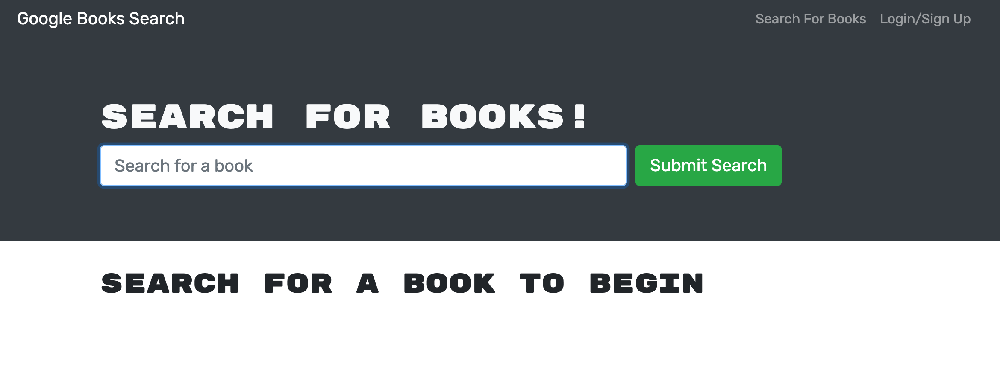

# Book It

  ###  

  ## Table of Contents
- [Book It](#book-it)
    - 
  - [Table of Contents](#table-of-contents)
  - [Description](#description)
  - [Installation](#installation)
  - [Usage](#usage)
  - [Contributing](#contributing)
  - [Tests](#tests)
  - [Questions](#questions)
  - [License](#license)

  ## Description 
  Book It is a MERN stack application with which authorized users can search the Google Books API and save the returned data to their profiles.  Note: This application is in-progress. <a href="https://quiet-meadow-40848.herokuapp.com/">Future Heroku Deployment Site</a> 
  
  ## Installation 
   Run npm i at the root level to install root, server, and client level dependencies and devDependencies.
  
  ## Usage
  "npm run develop" // see "scripts" in root-level package.json for detailed info.

  ## Contributing 
  Developers who have ideas for improvement may fork this project and submit pull requests for review.

  ## Tests
  n/a

  ## Questions 
  Please feel free to reach out via either of the links below if you have additional questions about this application. 
  GitHub: <a href="https://github.com/raposamillar/">raposamillar</a> 
  Email: lisa.raposamillar@gmail.com

  ## License
  ### This application is covered under the [GPL v3.0](https://choosealicense.com/licenses/gpl-3.0/) license.
  
  
  

